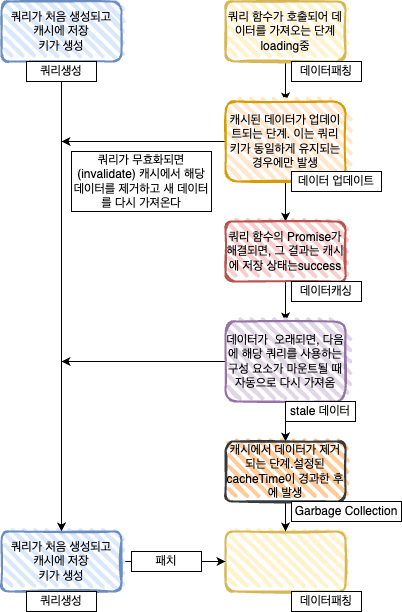

- [리액트 쿼리](#리액트-쿼리)
  - [개요](#개요)
  - [스터디원🤔](#스터디원)
  - [택 3](#택-3)
  - [1. 기본 설정, Devtools, Options](#1-기본-설정-devtools-options)
    - [React Query Devtools의 설치 및 활용 방법](#react-query-devtools의-설치-및-활용-방법)
    - [React Query의 주요 옵션들에 대한 이해](#react-query의-주요-옵션들에-대한-이해)
    - [React Query의 전반적인 아키텍처와 데이터 흐름에 대한 이해](#react-query의-전반적인-아키텍처와-데이터-흐름에-대한-이해)
    - [2. useQuery와 관련된 주요 리턴 데이터, 주요 옵션](#2-usequery와-관련된-주요-리턴-데이터-주요-옵션)
    - [3. useQuery 고급 기능 및 useQueryClient](#3-usequery-고급-기능-및-usequeryclient)
    - [4. Infinite Queries 및 초기 쿼리 데이터, Prefetching](#4-infinite-queries-및-초기-쿼리-데이터-prefetching)
    - [5. useMutation과 관련된 주요 기능 및 v5변경점](#5-usemutation과-관련된-주요-기능-및-v5변경점)
    - [6. 쿼리 무효화 및 캐시 데이터 업데이트, Optimistic Update](#6-쿼리-무효화-및-캐시-데이터-업데이트-optimistic-update)
      - [Lazy Queries](#lazy-queries)
      - [캐시 데이터 즉시 업데이트 방법](#캐시-데이터-즉시-업데이트-방법)
      - [Optimistic Update 이해 및 활용](#optimistic-update-이해-및-활용)
    - [7. 기타 특징 및 고급 기능 -](#7-기타-특징-및-고급-기능--)
  - [시간](#시간)
  - [발표내용](#발표내용)

# 리액트 쿼리


## 개요

그동안 래퍼런스를 보고 기능구현이나 맞춰진형식에 코드를 짯다면 각종 디자인패턴을 익혀 상황에 맞는 서비스에맞는 코드구현이나 유연성있는 코드작성을 하기위해 시작

> 리액트는 함수형 프로그래밍 패러다임과 선언형 프로그래밍 스타일을 사용함.
> 컴포넌트 기반 아키텍처를 사용하여 개발자가 사용자 인터페이스를 구축할 수 있다. 이렇게 > 컴포넌트를 중심으로 구축하는 방식 때문에 리액트는 다양한 디자인 패턴을 가질 수 있다.

## 스터디원🤔

---

  <a href="https://github.com/nonjk2">
      
  </a>
  <a href="https://github.com/helloworld442">
      
  </a>

  <a href="https://github.com/junho01052">
      
  </a>

  <a href="https://github.com/Hyeon12">
      
  </a>

   <a href="https://github.com/makepin2r">
      
  </a>

  <a href="https://github.com/kangsinbeom">
      
  </a>
  <a href="https://github.com/taehyunkim3">
      
  </a>
  <a href="https://github.com/TheON2">
      
  </a>
  <a href="https://github.com/Kang-Gyeongwon">
      
  </a>
## 택 3

리액트쿼리 사용법과 옵션들에 대해 알아보자

## 1. 기본 설정, Devtools, Options

- 리액트 쿼리는 데이터 패칭 라이브러리가 아니다.

- 리액트 쿼리가 리액트의 데이터 패칭에 있어서 숨겨진 퍼즐 조각이라고 종종 묘사되는 만큼 여러분들이 들으면 놀랄만한 사실이 있는데 그것은 바로 **리액트 쿼리는 데이터 패칭 라이브러리가 아니라는 점**

```tsx
const query = useQuery({
  queryKey: ["todos"],
  queryFn: axios.get("/api").then((res) => res.data),
});
```

```tsx
const mutation = useMutation({
  mutationFn: axios.post("/api", data),
  onSuccess: () => {
    queryClient.invalidateQueries({ queryKey: ["todos"] });
  },
});
```

예시코드를 보면 어디서 데이터 패치가 이루어지는지 직관적으로 보임.
리액트 쿼리가 관여하는 부분은 queryFn 의 실행 결과로 `fulfilled` 혹은 `rejected` 상태인 `Promise` 객체가 반환된 이후 뿐.

즉 queryFn 에는 그냥 Promise를 반환하면 됨.

QnA : 그렇다면 그냥 아무 Promise를 넣으면 될까 ?

```jsx
const 기달려 = (amount = 0) => new Promise((resolve) => setTimeout(resolve, amount));

function 타이머() {
  const { status, isIdle, isLoading, isSuccess } = useQuery("timer", () => 기달려(5000));

  if (isIdle || isLoading) {
    return <div>기달요</div>;
  }

  if (isSuccess) {
    return <div>끝남요</div>;
  }

  return null;
}

export default 타이머;
```

[보자](https://velog.io/@seungchan__y/React-Query-%EC%A0%81%EC%9C%BC%EB%A1%9C-%EC%82%AC%EA%B3%A0%ED%95%98%EA%B8%B0#3-%ED%8C%8C%EB%9D%BC%EB%AF%B8%ED%84%B0%EB%93%A4%EC%9D%84-%EC%9D%98%EC%A1%B4%EC%84%B1%EC%9C%BC%EB%A1%9C-%EB%B0%9B%EC%95%84%EB%93%A4%EC%97%AC%EB%9D%BC)
이것도 된다.

자 그럼 리액트 쿼리는 뭘까 ?

찾아본 래퍼런스에서는
**비동기 상태 관리자(Async State Manager)** 라고 지칭한다.
[리액트 쿼리 창시자의 발표](https://www.youtube.com/watch?v=seU46c6Jz7E) 시간남을때에 보자

- React Query의 설치 및 초기 설정

```shell
npm i @tanstack/react-query
```

```jsx
const queryClient = new QueryClient();

function App() {
  return (
    <QueryClientProvider client={queryClient}>
      <Todos />
    </QueryClientProvider>
  );
}
```

### React Query Devtools의 설치 및 활용 방법

```shell
npm i @tanstack/react-query-devtools
```

```jsx
import { ReactQueryDevtools } from "@tanstack/react-query-devtools";

function App() {
  return (
    <QueryClientProvider client={queryClient}>
      {...app}
      <ReactQueryDevtools initialIsOpen={false} />
    </QueryClientProvider>
  );
}
```

```
initialIsOpen: Boolean
true개발 도구가 기본적으로 열려 있도록 하려면 이것을 설정하십시오.
buttonPosition?: "top-left" | "top-right" | "bottom-left" | "bottom-right"
기본값은bottom-left
devtools 패널을 열고 닫는 React Query 로고의 위치
position?: "top" | "bottom" | "left" | "right"
기본값은bottom
React Query devtools 패널의 위치
client?: QueryClient,
사용자 정의 QueryClient를 사용하려면 이것을 사용하십시오. 그렇지 않으면 가장 가까운 컨텍스트의 것이 사용됩니다.
errorTypes?: { name: string; initializer: (query: Query) => TError}
이를 사용하여 쿼리에서 트리거될 수 있는 일부 오류를 미리 정의합니다. 해당 오류가 UI에서 토글되면 이니셜라이저가 호출됩니다(특정 쿼리 포함). 오류를 반환해야 합니다.
```

### React Query의 주요 옵션들에 대한 이해

staleTime: 데이터가 얼마나 빨리 새로운 것으로 간주될지 정하는 데 사용. 기본값은 0.
cacheTime: 성공한 쿼리 데이터가 캐시에 얼마나 오래 보관될지를 설정하는 옵션. 기본값은 5 분.
refetchOnWindowFocus: 창이 포커스 될 때마다 쿼리를 다시 가져올지 여부설정. 기본값은 true.
retry: 쿼리가 실패했을 때 재시도 횟수를 설정. 기본값은 3.
queryKey: 캐시에서 쿼리 결과를 식별하는 데 사용되는 키.
queryFn: 데이터를 패치하는 데 사용되는 함수.

### React Query의 전반적인 아키텍처와 데이터 흐름에 대한 이해



> 쿼리 생성: 서버 요청 X. 쿼리가 생성되고 queryFn이 설정된다.
>
> 데이터 패칭: 여기서 실제 서버 요청이 발생. queryFn이 실행되어 데이터를 패치.
>
> 데이터 캐싱: 서버 요청 X. 패치된 데이터가 캐시에 저장.
>
> 데이터 업데이트: 이 단계에서는 쿼리가 무효화되었거나 캐시된 데이터가 stale 상태일 경우에만 서버 요청이 발생.
>
> Stale 데이터: 이 단계 자체에서는 서버 요청이 X. 단지 데이터가 stale 상태가 될 때를 판단하는 것입니다. 만약 데이터가 stale 상태가 되면, 다음 useQuery 호출에서 데이터를 패치.
>
> 가비지 컬렉션: 서버 요청 X. cacheTime이 지나면 쿼리 및 결과 데이터는 캐시에서 제거. >

[래퍼런스 우아한테크](https://www.youtube.com/watch?v=MArE6Hy371c)

### 2. useQuery와 관련된 주요 리턴 데이터, 주요 옵션

민승
신범 : https://gnae16.tistory.com/104

- **useQuery 기본 문법**
- useQuery 주요 리턴 데이터, v4부터의 변화
- staleTime과 cacheTime, refetchOnMount, refetchOnWindowFocus, Polling, enabled refetch

### 3. useQuery 고급 기능 및 useQueryClient

승현 : https://github.com/makepin2r/makepin2r.github.io/blob/main/_posts/2023-07-30-useQueryClient-useQuery.md

- onSuccess, onError, onSettled
- select, keepPreviousData, placeholderData
- Parallel, Dependent Queries, useQueryClient
- useQuery의 delayQuery 이해 및 활용

### 4. Infinite Queries 및 초기 쿼리 데이터, Prefetching

태현 : https://kthdev.tistory.com/195
소현 :

- useQuery로 infinitequery를 비슷하게 사용법
- Infinite Queries 사용 방법
- Initial Query Data 설정 방법
- Prefetching의 이해 및 활용

### 5. useMutation과 관련된 주요 기능 및 v5변경점

준호 : https://jayspod.tistory.com/41
경원

- useMutation 기본 사용법
- mutate와 mutateAsync 비교
- cancelQueries 이해 및 활용
- invalidateQueries 이해 및 활용

### 6. 쿼리 무효화 및 캐시 데이터 업데이트, Optimistic Update

은석

<br>

#### Lazy Queries

---

<br>
사용법부터 보자

```jsx
const { execute, isLoading, data } = useLazyQuery(queryKey, fetchFunction)

<Button onClick={execute}>Load Data</Button>

```

**Lazy Queries**는 React Query가 제공하는 기능 중 하나로, 쿼리가 렌더링 시점에 자동으로 실행되지 않고, 개발자가 직접 실행 시점을 결정할 수 있도록 만든 기능.

다음과 같은 상황에서 Lazy Queries를 사용하는 것이 유용하다:

1. **사용자 인터랙션에 의존하는 데이터 로딩**: 사용자가 특정 버튼을 클릭하거나, 폼을 제출하는 등의 명확한 액션을 취할 때 데이터를 가져와야 하는 경우에 Lazy Queries를 활용할 수 있다. 예를 들어, "더보기" 버튼을 클릭했을 때 추가 데이터를 로드하는 상황 등이 있을 수 있다.

2. **조건부 데이터 요청**: 특정 조건이 만족되었을 때만 데이터를 요청하고 싶은 경우에도 Lazy Queries를 사용한다. 예를 들어, 사용자가 로그인을 완료한 후에만 사용자 프로필 데이터를 요청하는 등의 상황이 있을 수 있다.

3. **필요에 따른 재요청**: 데이터를 최초 한 번만 로드하는 것이 아니라, 필요에 따라 여러 번 재요청해야 하는 경우에도 Lazy Queries를 활용할 수 있습니다. 예를 들어, 사용자가 특정 조건을 변경할 때마다 새로운 데이터를 가져와야 하는 필터 기능을 구현하는 경우 등이 있을 수 있다.

<br>

#### 캐시 데이터 즉시 업데이트 방법

---

<br>

**캐시 데이터 즉시 업데이트** 기능은 서버에 데이터를 변경하는 요청을 보낸 후, 그 응답을 기다리지 않고 바로 UI를 업데이트할 때 유용

예)

1. **네트워크 지연이 사용자 경험에 영향을 미치는 경우** : 데이터를 보내고 ui 그 데이터에따라 ui가 바뀌어야하는데 안바뀌면 사용자 경험 ~~조져버림~~ 안좋아짐 , 이 때 캐시 데이터를 즉시 업데이트 하면 됨

2. **데이터 변경이 자주 발생하는 경우**: 사용자가 데이터를 자주 변경하는 경우에는 서버 응답을 기다리는 대신 캐시 데이터를 즉시 업데이트하는 것이 효율적일 수 있다.
   v3기준

```jsx
const mutation = useMutation((newTodo) => api.post("/todos", newTodo), {
  onMutate: async (newTodo) => {
    queryClient.cancelQueries(["todos"]);

    const previousTodos = queryClient.getQueryData(["todos"]);

    queryClient.setQueryData(["todos"], (old) => [...old, newTodo]);

    return { previousTodos };
  },
  onError: (err, newTodo, context) => {
    queryClient.setQueryData(["todos"], context.previousTodos);
  },
  onSettled: () => {
    queryClient.invalidateQueries(["todos"]);
  },
});
```

#### Optimistic Update 이해 및 활용

---

```jsx
const mutation = useMutation(postComment, {
  onMutate: async (newComment) => {
    const previousComments = queryClient.getQueryData(["comments"]);
    queryClient.setQueryData(["comments"], (old) => [...old, newComment]);.
    return { previousComments };
  },
  onError: (err, newComment, context) => {
    queryClient.setQueryData(["comments"], context.previousComments);
  },
});
```

### 7. 기타 특징 및 고급 기능 -

시간남는분만 하시길 권장

- useQueryErrorResetBoundary 이해 및 활용
- React Query와 Suspense의 통합 이해 및 활용
- Default Query Function 이해 및 활용
- React Query와 TypeScript의 통합 이해 및 활용

이렇게 각 주제를 세분화하면 주제별로 배울 내용이 균등하게 분배되고, 모든 중요한 옵션들에 대해 다룰 수 있을 것입니다.

[리액트 쿼리 Docs](https://tanstack.com/query/v5/docs/react/overview)

## 시간

## 발표내용

- 언제 이용하는지 사용하므로서 일어나는 일 정리
- 간단히 적용한 코드 예시 코드
- 약 1~5분 발표
