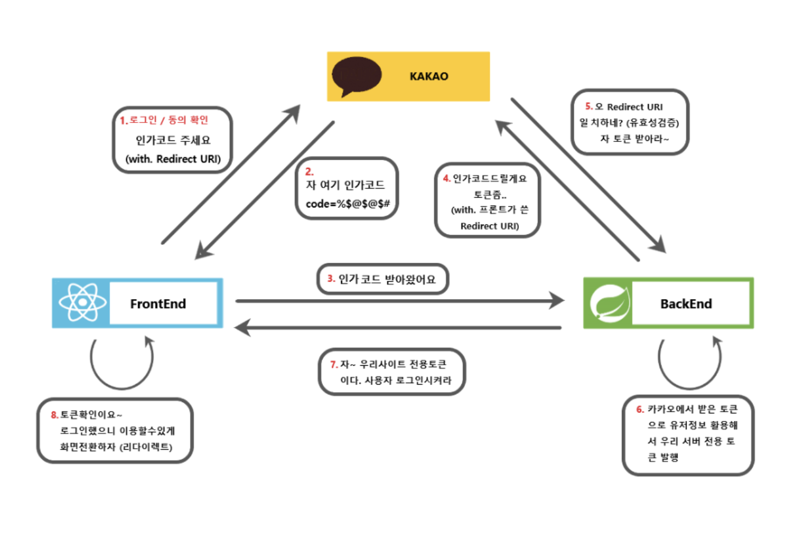
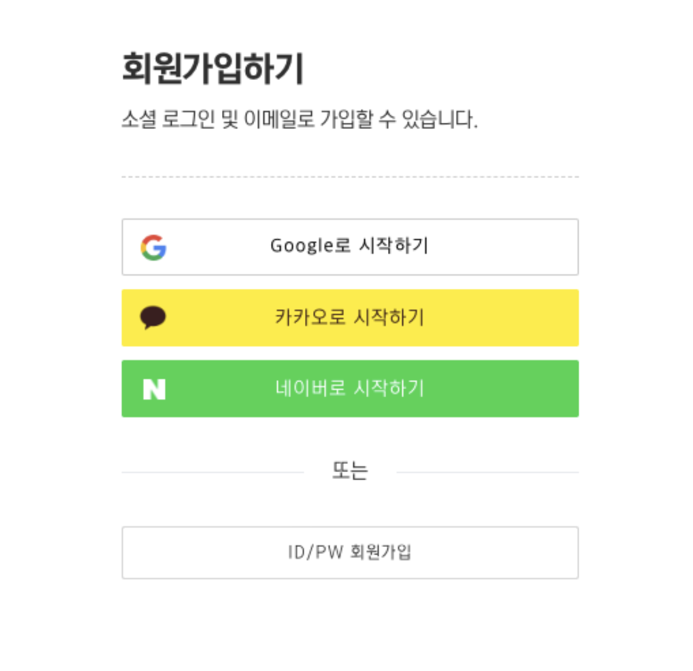

- [리액트 소셜로그인 기능 구현](#리액트-소셜로그인-기능-구현)
  - [개요](#개요)
  - [스터디원🤔](#스터디원)
  - [소셜로그인 로직](#소셜로그인-로직)
  - [순서](#순서)
  - [각 3사 소셜로그인 키 받기](#각-3사-소셜로그인-키-받기)
  - [서버 시작](#서버-시작)
  - [서버 주요 API](#서버-주요-api)
  - [완성 조건](#완성-조건)
  - [화이팅입니다](#화이팅입니다)

# 리액트 소셜로그인 기능 구현

## 개요

각각의 리액트를 다루는 폼이나 자주쓰는 기능을 단시간내에 구현하는것을 연습하여 로직이나 훅을 통한 기능 구현 을 친숙화하는것을 목표로 시작

## 스터디원🤔

---

  <a href="https://github.com/nonjk2">
      
  </a>
  <a href="https://github.com/helloworld442">
      
  </a>
  <a href="https://github.com/makepin2r">
      
  </a>
  <a href="https://github.com/TheON2">
      
  </a>
  <a href="https://github.com/junho01052">
      
  </a>

  <a href="https://github.com/Hyeon12">
      
  </a>

  <a href="https://github.com/nayoung3669">
      
  </a>

  <a href="https://github.com/doyoung1002">
      
  </a>
  <a href="https://github.com/Haru-Im">
      
  </a>
  <a href="https://github.com/taehyunkim3">
      
  </a>
  <a href="https://github.com/kangsinbeom">
      
  </a>

  <a href="https://github.com/khu107">
      
  </a>

## 소셜로그인 로직

- 

## 순서

- [도원님GitHub](https://github.com/TheON2/SocialServer-back)

1. 도원님 백엔드 깃클론 하기
2. Frontend , Backend 폴더 나누기
3. Frontend에서 로그인폼 만들기 -> 로그인폼은 자유
   예시)
   

## 각 3사 소셜로그인 키 받기

- 리다이렉트 URI는 프론트엔드쪽
- **열심히 구글링 시작**
- [카카오 로그인 이해하기](https://developers.kakao.com/docs/latest/ko/kakaologin/common)
- [네이버 로그인 이해하기](https://developers.naver.com/docs/login/devguide/devguide.md#1--%EA%B0%9C%EC%9A%94)
- [구글 로그인 이해하기](https://developers.google.com/identity/gsi/web/reference/js-reference?hl=ko)

## 서버 시작

```shell
nodemon app
```

으로 백엔드 서버 시작

## 서버 주요 API

| API               | Description                                                           | Parameters     | Authentication                                    | Response                                                | Error                                                        |
| ----------------- | --------------------------------------------------------------------- | -------------- | ------------------------------------------------- | ------------------------------------------------------- | ------------------------------------------------------------ |
| POST /kakaoLogin  | Kakao 계정으로 로그인하는 API입니다.                                  | `code` (query) | Not required                                      | 200 (OK), 사용자 정보와 JWT를 반환합니다.               | 올바르지 않은 요청 시 오류 반환                              |
| POST /naverLogin  | Naver 계정으로 로그인하는 API입니다.                                  | `code` (query) | Not required                                      | 200 (OK), 사용자 정보와 JWT를 반환합니다.               | 올바르지 않은 요청 시 오류 반환                              |
| POST /googleLogin | Google 계정으로 로그인하는 API입니다.                                 | `code` (query) | Not required                                      | 200 (OK), 사용자 정보와 JWT를 반환합니다.               | 올바르지 않은 요청 시 오류 반환                              |
| GET /usertoken    | 사용자의 JWT를 검증하고 해당 사용자를 반환하는 API입니다.             | Not required   | JWT가 헤더에 포함되어 있어야 합니다.              | 200 (OK), 사용자 정보를 반환합니다.                     | 유효하지 않은 토큰 또는 사용자를 찾을 수 없는 경우 오류 반환 |
| GET /refreshToken | 사용자의 JWT refresh 토큰을 검증하고 새로운 JWT를 생성하는 API입니다. | Not required   | JWT refresh 토큰이 쿠키에 포함되어 있어야 합니다. | 200 (OK), 새로운 JWT를 반환합니다.                      | 유효하지 않은 토큰인 경우 오류 반환                          |
| POST /user/logout | 사용자를 로그아웃하고 JWT refresh 토큰을 무효화하는 API입니다.        | Not required   | Not required                                      | 쿠키에서 JWT refresh 토큰을 제거하고 'ok'를 반환합니다. | -                                                            |

## 완성 조건

- **STEP 1** : 소셜로그인 규격 로그인 버튼을 넣고 인가코드까지 받아오기.
- **STEP 2** : 백엔드 서버를 통하여 accessToken 받고 로그인 완료. 로그아웃 완료
- **STEP 3** : 자동로그인 , token 삭제시 라우팅처리

## 화이팅입니다
