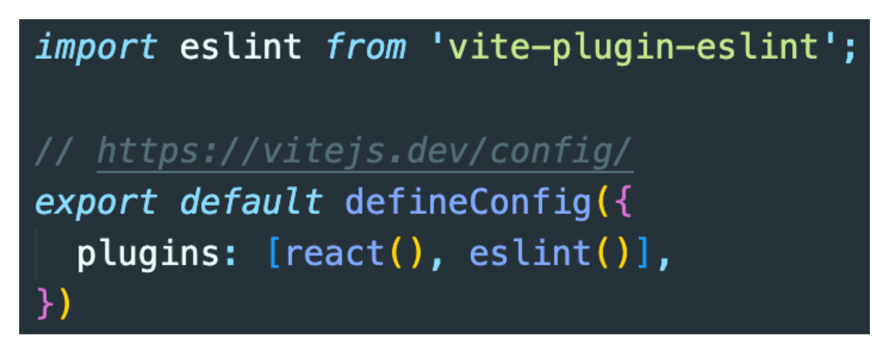
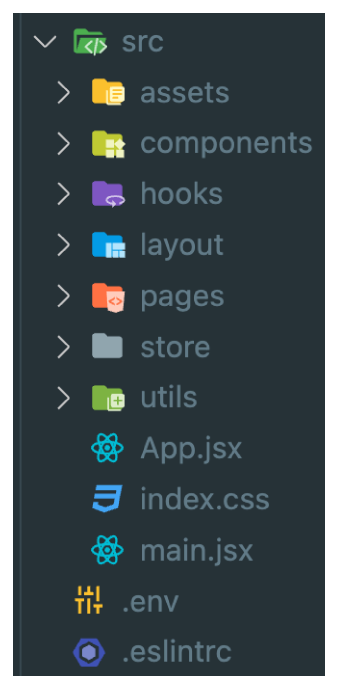

### 목차

- [리액트 페이지네이션 기능 구현](#리액트-페이지네이션-기능-구현)
  - [개요](#개요)
  - [스터디원🤔](#스터디원)
  - [세팅](#세팅)
    - [vite로 react 생성](#vite로-react-생성)
    - [CSS 프레임워크 (스타일) 자유](#css-프레임워크-스타일-자유)
    - [TypeScript](#typescript)
    - [eslint](#eslint)
    - [폴더구조](#폴더구조)
    - [리덕스 사용](#리덕스-사용)
    - [API](#api)
    - [이미지 디자인페이지 통일](#이미지-디자인페이지-통일)
    - [코드리뷰](#코드리뷰)

# 리액트 페이지네이션 기능 구현

## 개요

각각의 리액트를 다루는 폼이나 자주쓰는 기능을 단시간내에 구현하는것을 연습하여 로직이나 훅을 통한 기능 구현 을 친숙화하는것을 목표로 시작

## 스터디원🤔

---

  <a href="https://github.com/nonjk2">
      
  </a>

  <a href="https://github.com/helloworld442">
      
  </a>

  <a href="https://github.com/Hyeon12">
      
  </a>

  <a href="https://github.com/nayoung3669">
      
  </a>

  <a href="https://github.com/doyoung1002">
      
  </a>
  <a href="https://github.com/Haru-Im">
      
  </a>
  <a href="https://github.com/taehyunkim3">
      
  </a>
  <a href="https://github.com/kangsinbeom">
      
  </a>

---

## 세팅

### vite로 react 생성

```shell
npm init vite
```

### CSS 프레임워크 (스타일) 자유

- [x] styled-components
- [ ] Emotion
- [x] Styled-jsx
- [ ] Material-UI
- [ ] tailwind CSS

```shell
npm install react-router-dom styled-components
```

### TypeScript

- 하면 좋지만 안하는거 추천 끝나고 풀리퀘 코드리뷰할껀데 서로 보기 불편함
- tsconfig 설정 본인이 알아서

```shell
npm install @types/styled-components
```

### eslint

```shell
npm install -D vite-plugin-eslint eslint eslint-config-react-app
```


<br>
.eslintrc
대충 본인이 커스텀

<details>
  <summary>.eslintrc</summary>
  <div markdown="1">

```shell
{
  "env": { "browser": true, "es2020": true },
  "extends": [
    "eslint:recommended",
    // "plugin:@typescript-eslint/recommended",
    "plugin:react-hooks/recommended"
  ],
  // "parser": "@typescript-eslint/parser",
  "parserOptions": { "ecmaVersion": "latest", "sourceType": "module" },
  "plugins": ["react-refresh"],
  "rules": {
    "react-refresh/only-export-components": "warn"
  }
}

```

  </div>
</details>

<br>

### 폴더구조

<center>
   
</center>
<br>

### 리덕스 사용

- 하면 좋음
- 안해도 좋음
- contextAPI 가능

<br>

### API

- [OpenAPI 고양이 사이트](https://thecatapi.com/)
  - 들어가서 내려가지고 Free 버전 사용
  - email로 api key 받기
  - **https://api.thecatapi.com/v1/images/search** 기본 요청
  - 헤더에 받은 X-api-key 꼭 넣기
    - **post man 으로 미리 넘겨서 확인.**
  - 쿼리로 개수제한과 페이지번호를 넘기기
    - 요청부분
      | Name | Type | Description | Default |
      |-------------|------------------|-----------------------------------------------------------------|---------|
      | limit | 1-100 | 반환할 이미지의 개수를 지정합니다. | 1 |
      | page | 0-n | 이미지를 페이지별로 조회할 때 사용할 페이지 번호를 지정합니다. | 0 |
      | order | ASC/DESC/RAND | 이미지를 업로드된 날짜순으로 정렬하는 방식을 지정합니다. | RAND |
      | has_breeds | 1 or 0 | 종 정보가 있는 이미지만 반환합니다. | 0 |
      | breed_ids | 쉼표로 구분된 문자열 | 이미지를 필터링할 특정 종의 ID를 지정합니다. | 없음 |
      | category_ids| 쉼표로 구분된 문자열 | 이미지를 필터링할 특정 카테고리의 ID를 지정합니다. | 없음 |
      | sub_id | 문자열 | 업로드할 때 사용한 sub_id 값을 가진 이미지만 반환합니다. | 없음 |

<br>

### 이미지 디자인페이지 통일

- [웹디자인](https://gsap-flip-grid-view.webflow.io/)
- 리스트 밑에 페이지네이션 기능과 넣으면됌
- 페이지 번호 디자인은 본인 개성따라서
- color는 자유
  <br>

### 코드리뷰

- 끝나고 완성본 한번씩 둘러보고 상대 깃허브 코맨트 하나이상씩 남기기 (피드백 ,칭찬)
